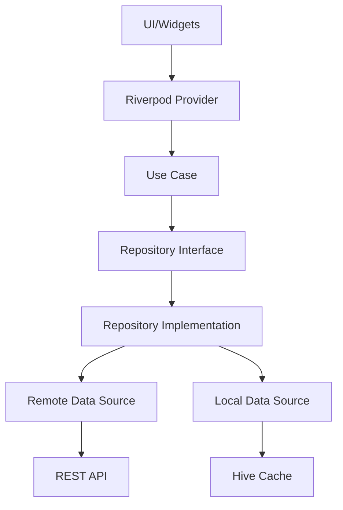

# 🏗️ Architecture EcoPlates

## Vue d'ensemble

EcoPlates suit une **Clean Architecture** stricte avec séparation des préoccupations et inversion des dépendances. L'application est construite avec Flutter et utilise Riverpod pour la gestion d'état et l'injection de dépendances.

## 📁 Structure des dossiers

```
lib/
├── core/                    # Code partagé et utilitaires
│   ├── constants/          # Constantes de l'application
│   ├── error/              # Gestion des erreurs et failures
│   ├── extensions/         # Extensions Dart
│   ├── network/            # Client API et configuration réseau
│   ├── providers/          # Dependency injection avec Riverpod
│   ├── router/             # Configuration du routing (GoRouter)
│   ├── services/           # Services transversaux
│   ├── themes/             # Thèmes Material et Cupertino
│   ├── use_cases/          # Interfaces de base pour les use cases
│   ├── utils/              # Utilitaires divers
│   └── widgets/            # Widgets réutilisables
│
├── data/                   # Couche Data
│   ├── data_sources/       # Sources de données (API, Cache)
│   ├── models/             # Modèles de données (DTO)
│   └── repositories/       # Implémentations des repositories
│
├── domain/                 # Couche Domain (Business Logic)
│   ├── entities/           # Entités métier
│   ├── repositories/       # Interfaces des repositories
│   └── use_cases/          # Use cases (logique métier)
│
└── presentation/           # Couche Presentation (UI)
    ├── providers/          # State management providers
    ├── screens/            # Écrans de l'application
    └── widgets/            # Widgets spécifiques aux features
```

## 🎯 Principes d'architecture

### 1. Clean Architecture Layers

#### Domain Layer (Centre)
- **Entités** : Objets métier purs (FoodOffer, Merchant, User)
- **Repositories** : Interfaces abstraites
- **Use Cases** : Logique métier encapsulée
- ❌ Aucune dépendance externe

#### Data Layer
- **Models** : DTOs pour la sérialisation/désérialisation
- **Data Sources** : Accès aux données (API, Cache)
- **Repository Implementations** : Orchestration des data sources
- ✅ Implémente les interfaces du Domain

#### Presentation Layer
- **Screens** : Pages de l'application
- **Widgets** : Composants UI réutilisables
- **Providers** : Gestion d'état avec Riverpod
- ✅ Dépend uniquement du Domain

### 2. Dependency Injection

```dart
// Exemple de DI avec Riverpod
final foodOfferRepositoryProvider = Provider<FoodOfferRepository>((ref) {
  final remoteDataSource = ref.watch(foodOfferRemoteDataSourceProvider);
  final localDataSource = ref.watch(foodOfferLocalDataSourceProvider);
  final apiClient = ref.watch(apiClientProvider);
  
  return FoodOfferRepositoryImpl(
    remoteDataSource: remoteDataSource,
    localDataSource: localDataSource,
    apiClient: apiClient,
  );
});
```

### 3. Error Handling

Utilisation du type `Either<Failure, Success>` pour la gestion des erreurs :

```dart
Future<Either<Failure, List<FoodOffer>>> getUrgentOffers() async {
  try {
    final offers = await remoteDataSource.getUrgentOffers();
    return Right(offers);
  } on ServerException {
    return Left(ServerFailure());
  } catch (e) {
    return Left(UnexpectedFailure());
  }
}
```

## 🔄 Flux de données



## 🚀 Features clés

### 1. Offline-First Architecture
- Cache automatique avec Hive
- Synchronisation en arrière-plan
- Queue pour les actions offline

### 2. Reactive State Management
- Providers auto-dispose pour la mémoire
- Stream providers pour temps réel
- State notifiers pour logique complexe

### 3. Modular Design
- Features isolées
- Widgets atomiques réutilisables
- Séparation merchant/consumer

### 4. Performance Optimizations
- Lazy loading des images
- Pagination des listes
- Debouncing des recherches
- Widget memoization

## 📱 Routing

Utilisation de GoRouter avec shells pour navigation complexe :

```dart
ShellRoute(
  builder: (context, state, child) => ConsumerShell(child: child),
  routes: [
    GoRoute(path: '/discover', builder: (_, __) => DiscoverScreen()),
    GoRoute(path: '/browse', builder: (_, __) => BrowseScreen()),
    // ...
  ],
)
```

## 🧪 Testing Strategy

### Unit Tests
- Use cases : 100% coverage
- Repositories : Mocking des data sources
- Entities : Validation métier

### Widget Tests
- Components isolés
- Golden tests pour UI
- Interaction tests

### Integration Tests
- Flux utilisateur complets
- Tests offline/online
- Performance benchmarks

## 🔒 Security

- API Key sécurisée dans EnvConfig
- Pas de données sensibles en cache
- Validation côté client et serveur
- HTTPS obligatoire

## 📊 Monitoring

- Structured logging
- Crash reporting (Firebase Crashlytics ready)
- Performance monitoring
- Analytics events

## 🚦 CI/CD Pipeline

1. **Pre-commit** : Linting + formatting
2. **PR Checks** : Tests + coverage
3. **Build** : Multi-platform builds
4. **Deploy** : Automated store uploads

## 🎨 Design System

- Material 3 pour Android
- Cupertino pour iOS
- Adaptive widgets
- Thème centralisé

## 📈 Scalability

- Microservices ready
- Feature flags support
- A/B testing infrastructure
- Multi-tenant architecture

## 🔧 Development Setup

```bash
# Install dependencies
flutter pub get

# Generate code
flutter pub run build_runner build

# Run tests
flutter test

# Run app (dev mode)
flutter run --dart-define=ENV=dev
```

## 📚 Best Practices

1. **SOLID Principles** : Respectés dans toute l'architecture
2. **DRY** : Réutilisation maximale du code
3. **KISS** : Solutions simples privilégiées
4. **YAGNI** : Pas de sur-ingénierie
5. **Boy Scout Rule** : Laisser le code meilleur qu'on l'a trouvé

## 🤝 Contribution

Voir [CONTRIBUTING.md](CONTRIBUTING.md) pour les guidelines de contribution.