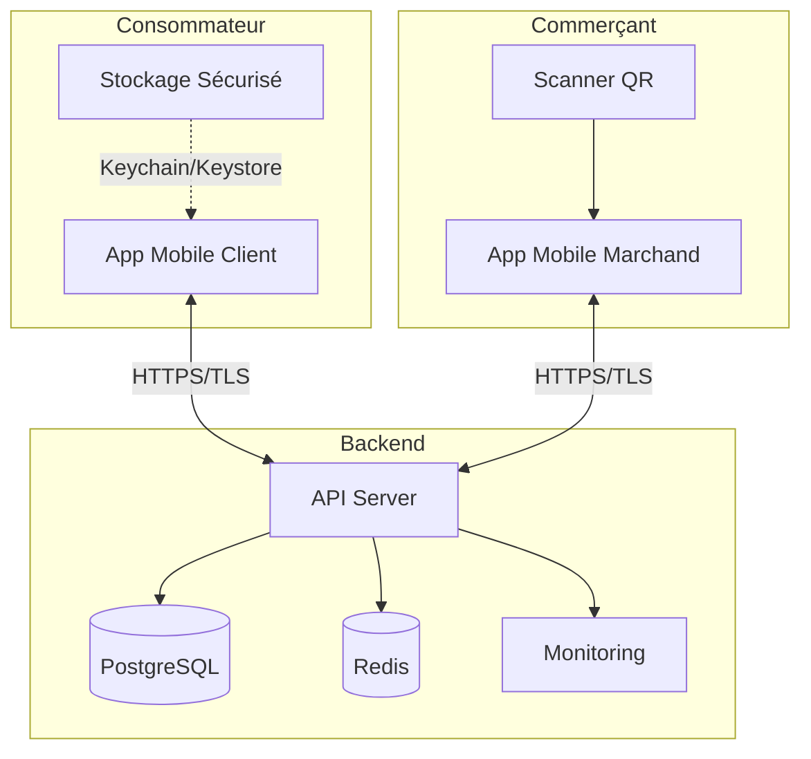
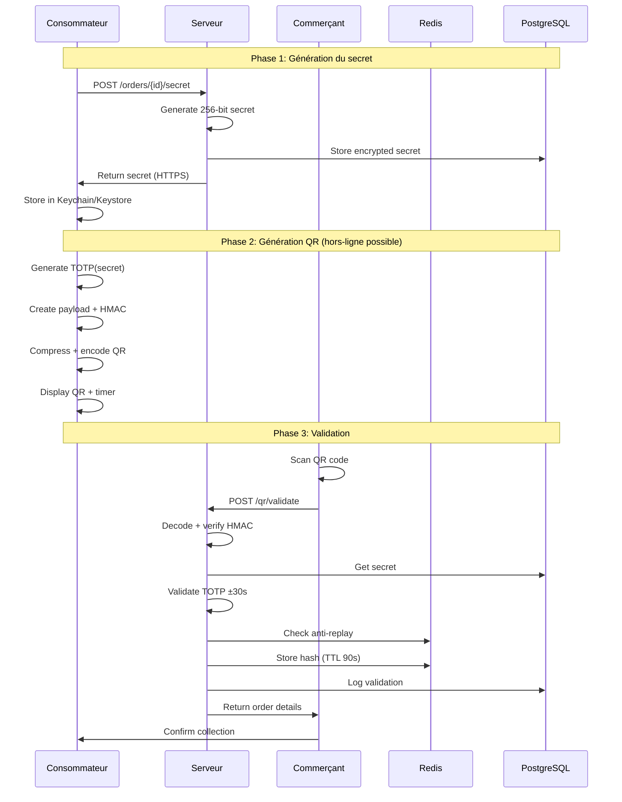

# 🏗️ Architecture de Sécurité QR Code - EcoPlates

## 📋 Table des matières

1. [Vue d'ensemble](#vue-densemble)
2. [Modèle de menaces](#modèle-de-menaces)
3. [Architecture technique](#architecture-technique)
4. [Flux de données](#flux-de-données)
5. [Protocole de sécurité](#protocole-de-sécurité)
6. [Métriques et SLA](#métriques-et-sla)

## 🎯 Vue d'ensemble

Le système de QR codes sécurisés d'EcoPlates utilise une architecture hybride basée sur TOTP (Time-based One-Time Password) avec signature HMAC-SHA256, permettant une validation semi-hors-ligne côté consommateur tout en maintenant la sécurité côté serveur.

### Acteurs du système



## 🛡️ Modèle de menaces

### Surfaces d'attaque identifiées

| Surface | Menace | Mitigation | Criticité |
|---------|---------|------------|-----------|
| QR Code | Replay attack | Token unique + fenêtre 30s + anti-replay cache | HAUTE |
| QR Code | Screenshot/Copie | Rotation automatique 30s + signature | HAUTE |
| Transmission | MITM | Certificate pinning + TLS 1.3 | HAUTE |
| Stockage mobile | Vol de secret | Keychain iOS / Keystore Android | HAUTE |
| API | Brute force | Rate limiting + monitoring | MOYENNE |
| Scanner | QR malicieux | Validation stricte du format | MOYENNE |
| Offline | Fraude hors-ligne | Sync obligatoire + TTL 24h | BASSE |

### Matrice de risques

```
Impact ↑
CRITIQUE │ Vol secret │ Replay    │           │
         │            │ massif    │           │
ÉLEVÉ    │ MITM       │ Screenshot│ Falsif.   │
         │            │           │ signature │  
MOYEN    │ Brute      │ QR        │ Déni      │
         │ force      │ malicieux │ service   │
FAIBLE   │            │ Fraude    │           │
         │            │ offline   │           │
         └────────────┴───────────┴───────────┘
           FAIBLE      MOYEN       ÉLEVÉ    → Probabilité
```

## 🏗️ Architecture technique

### Composants système



### Stack technique

- **Mobile (Flutter)**
  - `flutter_secure_storage`: Stockage sécurisé natif
  - `otp`: Génération TOTP RFC 6238
  - `crypto`: HMAC-SHA256
  - `qr_flutter`: Rendu QR optimisé
  - `mobile_scanner`: Scan haute performance

- **Backend**
  - Node.js/Go pour performance
  - PostgreSQL: Stockage persistant
  - Redis: Cache anti-replay
  - Prometheus/Grafana: Métriques

## 📊 Flux de données

### Format du payload QR

```json
{
  "v": "2.0",              // Version protocole
  "merchant_id": "uuid",    // ID marchand
  "consumer_id": "uuid",    // ID consommateur  
  "order_id": "uuid",       // ID commande
  "timestamp": 1706356200,  // Unix timestamp
  "token": "12345678",      // TOTP 8 digits
  "sig": "base64url..."     // HMAC-SHA256
}
```

### Pipeline de compression

```
JSON (250 bytes) 
  → Zlib compression (150 bytes)
  → Base64URL encoding (200 bytes)
  → QR Code generation
```

## 🔐 Protocole de sécurité

### Génération TOTP

```python
def generate_totp(secret: bytes, time: int) -> str:
    # Configuration
    DIGITS = 8
    PERIOD = 30
    ALGORITHM = hashlib.sha256
    
    # Time counter
    counter = time // PERIOD
    
    # HMAC generation
    hmac = HMAC(secret, counter.to_bytes(8, 'big'), ALGORITHM)
    
    # Dynamic truncation
    offset = hmac[-1] & 0x0F
    code = (hmac[offset:offset+4] & 0x7FFFFFFF) % (10**DIGITS)
    
    return str(code).zfill(DIGITS)
```

### Validation avec fenêtre de tolérance

```python
def validate_totp(secret: bytes, token: str, time: int) -> bool:
    WINDOW = 1  # ±30 secondes
    
    for delta in range(-WINDOW, WINDOW + 1):
        check_time = time + (delta * 30)
        expected = generate_totp(secret, check_time)
        
        if constant_time_compare(token, expected):
            return True
            
    return False
```

### Anti-replay Redis

```lua
-- Script Lua pour validation atomique
local key = KEYS[1]
local ttl = ARGV[1]

if redis.call("EXISTS", key) == 1 then
    return 0  -- Déjà utilisé
else
    redis.call("SETEX", key, ttl, "1")
    return 1  -- Succès
end
```

## 📈 Métriques et SLA

### Objectifs de performance

| Métrique | SLA | Seuil critique |
|----------|-----|----------------|
| Génération QR mobile | < 50ms | 100ms |
| Validation serveur P95 | < 200ms | 500ms |
| Taille QR optimale | 150-200 bytes | 250 bytes |
| Uptime API | 99.99% | 99.9% |
| Taux succès validation | > 99.5% | 99% |

### Dashboard monitoring

```
┌─────────────────────────────────────┐
│         QR Security Dashboard       │
├─────────────────┬───────────────────┤
│ Validations/min │ 1,247            │
│ Success Rate    │ 99.6%            │
│ Avg Latency     │ 127ms            │
│ Failed (24h)    │ 47               │
├─────────────────┴───────────────────┤
│ Failure Reasons:                    │
│ • Expired: 23 (48.9%)               │
│ • Invalid sig: 12 (25.5%)           │
│ • Replay: 8 (17.0%)                 │
│ • Other: 4 (8.5%)                   │
└─────────────────────────────────────┘
```

### Alertes critiques

- **Taux d'échec > 5%**: Alerte immédiate
- **Latence P95 > 500ms**: Investigation requise
- **Tentatives replay > 100/h**: Possible attaque
- **Erreurs signature > 1%**: Problème crypto

## 🔄 Plan de déploiement

### Phase 1: Beta testing (5%)
- Feature flag activé pour groupe test
- Monitoring intensif
- Collecte feedback UX

### Phase 2: Rollout progressif (5% → 50%)
- Augmentation graduelle
- A/B testing ancien vs nouveau
- Ajustements performance

### Phase 3: Déploiement complet (100%)
- Migration complète
- Désactivation ancien système
- Documentation mise à jour

## 🚨 Procédures d'urgence

### Révocation de secret

1. Client signale compromission
2. API `/revoke` appelée
3. Secret marqué révoqué en DB
4. Nouveau secret généré
5. Notification push au client

### Rollback rapide

```bash
# Feature flag pour rollback immédiat
{
  "qr_security_v2_enabled": false,
  "fallback_to_v1": true
}
```

---

*Document de référence architecture - Version 2.0*