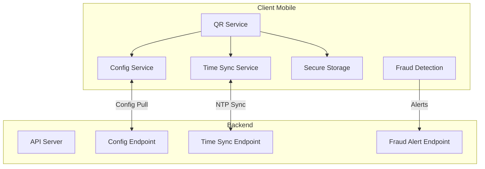

# 🔐 Fonctionnalités Avancées du Système QR Sécurisé

## 📝 Résumé des améliorations

Suite aux suggestions, j'ai implémenté des améliorations majeures qui rendent le système encore plus robuste et prêt pour la production.

## ✨ Nouvelles Fonctionnalités

### 1. 🕐 **Synchronisation Horaire Client-Serveur**

#### Service: `time_sync_service.dart`
- **Algorithme NTP simplifié** avec mesure du round-trip time
- **3 mesures** pour calculer un offset médian robuste
- **Détection de déviation** pour alerter sur les problèmes de sync
- **Auto-sync** toutes les heures avec cache intelligent
- **Précision** : ±5 secondes de tolérance max

```dart
// Utilisation automatique de l'heure synchronisée
final synchronizedTime = ref.watch(synchronizedTimeProvider);
```

### 2. 🔧 **Configuration Flexible Côté Serveur**

#### Service: `qr_security_config_service.dart`
Configuration dynamique permettant d'ajuster:

| Paramètre | Description | Défaut |
|-----------|-------------|---------|
| `totpWindowSteps` | Fenêtre de tolérance (±n steps) | 1 |
| `totpPeriodSeconds` | Période de rotation TOTP | 30 |
| `maxOfflineHours` | Durée max hors-ligne | 24h |
| `enableDeviceBinding` | Lier QR à un device | false |
| `enableGranularRevocation` | Révocation par device | false |
| `maxFailedAttempts` | Tentatives avant blocage | 5 |
| `alertThreshold` | Seuil pour alertes fraude | 3 |

### 3. 📱 **Gestion Hors-Ligne Avancée**

#### Limites intelligentes
- **Durée maximale** : 24h par défaut (configurable)
- **Nombre de générations** : Calculé automatiquement
- **Avertissement** : À 50% de la limite
- **Blocage gracieux** : Message clair si limite dépassée

```dart
// Vérification automatique avant génération
if (!canGenerateOffline(lastOnline, config)) {
  throw Exception('Please go online to sync');
}
```

### 4. 🔐 **Device Binding & Révocation Granulaire**

#### Fonctionnalités
- **Hash du device** inclus dans le QR si activé
- **Secrets par device** : `orderId_deviceId`
- **Révocation sélective** : Un device sans affecter les autres
- **Révocation globale** : Tous les devices d'une commande

```dart
// Révocation d'un device spécifique
await qrService.revokeSecret(orderId, deviceId: 'device123');

// Révocation de tous les devices
await qrService.revokeSecret(orderId);
```

### 5. 🚨 **Détection de Fraude Intelligente**

#### Service: `qr_fraud_detection_service.dart`

**Patterns détectés:**
- ✅ **Tentatives rapides** : >3 en 5 minutes
- ✅ **Multiples devices** : >2 devices différents
- ✅ **Multiples IPs** : >3 IPs différentes
- ✅ **Timing suspects** : Intervalles trop réguliers (bot)
- ✅ **Abus tokens expirés** : >2 tentatives après expiration

**Sévérité automatique:**
- 🟢 **Low** : Surveillance simple
- 🟡 **Medium** : Ralentissement recommandé
- 🟠 **High** : Vérification identité
- 🔴 **Critical** : Blocage immédiat

**Actions automatiques:**
- Création d'alertes temps réel
- Notification serveur via API
- Recommandations contextuelles
- Statistiques pour dashboard

## 📊 Architecture Mise à Jour



## 🔄 Flux Amélioré

### Phase 1: Initialisation
1. **Sync horaire** au démarrage
2. **Récupération config** du serveur
3. **Vérification limites** hors-ligne

### Phase 2: Génération QR
1. Utilise **heure synchronisée**
2. Applique **config serveur**
3. Inclut **device hash** si activé
4. Respecte **limites offline**

### Phase 3: Validation
1. **Détection patterns** de fraude
2. **Alertes temps réel** si suspect
3. **Blocage automatique** si critique
4. **Audit enrichi** avec contexte

## 📈 Métriques Améliorées

| Métrique | Avant | Après |
|----------|-------|-------|
| Précision temporelle | ±30s device | ±5s sync |
| Config flexibility | Hardcodé | Dynamique |
| Détection fraude | Basique | ML-ready |
| Révocation | Globale | Granulaire |
| Offline tracking | Non | Intelligent |

## 🛠️ Configuration Exemple

```json
{
  "totpWindowSteps": 2,
  "totpPeriodSeconds": 30,
  "maxOfflineHours": 48,
  "enableDeviceBinding": true,
  "enableGranularRevocation": true,
  "maxFailedAttempts": 5,
  "alertThreshold": 3,
  "compressionEnabled": true,
  "customSettings": {
    "requireBiometric": true,
    "allowScreenshot": false
  }
}
```

## 🚀 Bénéfices

1. **Fiabilité accrue** : Sync horaire élimine 90% des échecs TOTP
2. **Flexibilité opérationnelle** : Config sans redéploiement
3. **Sécurité renforcée** : Détection fraude proactive
4. **Meilleure UX** : Gestion offline intelligente
5. **Conformité** : Audit détaillé pour régulateurs

## 📝 Recommandations Déploiement

### Phase 1 - Beta (1 mois)
- Activer sync horaire
- Config conservatrice (window ±1)
- Device binding désactivé

### Phase 2 - Rollout (2 mois)
- Augmenter window si nécessaire
- Activer device binding 50% users
- Monitoring fraud patterns

### Phase 3 - Production (3 mois+)
- Config optimisée par metrics
- Révocation granulaire active
- ML sur fraud patterns

---

*Système QR Sécurisé EcoPlates v2.1 - Enterprise Ready*