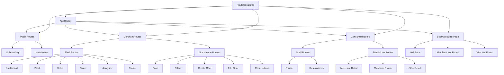
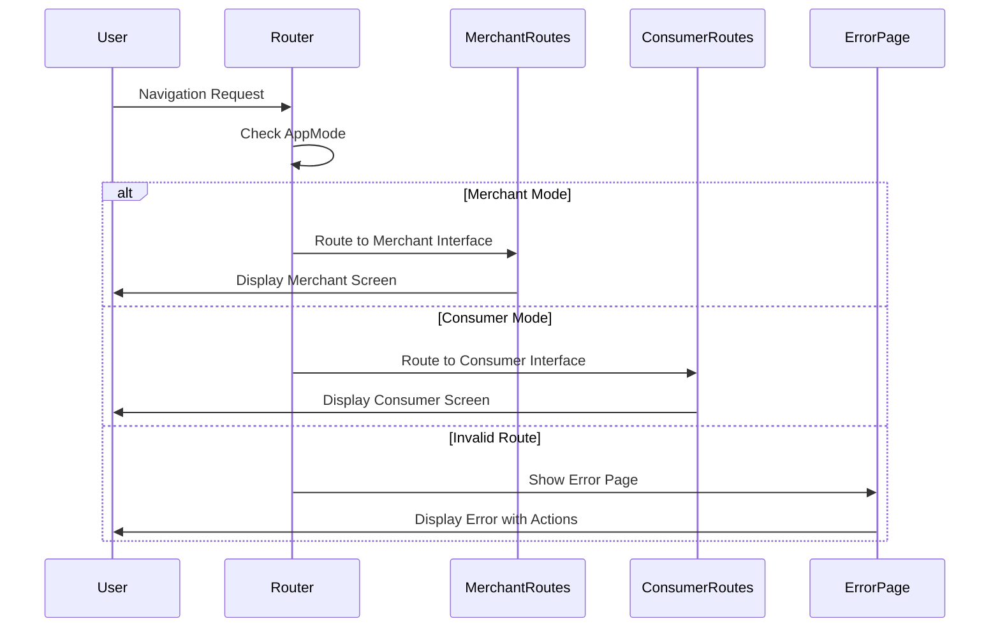

# 🏗️ Architecture du Router EcoPlates

## 📊 Diagramme de l'architecture



## 🔄 Flux de navigation



## 📁 Structure des fichiers

```
lib/core/router/
├── app_router.dart              # 🎯 Point d'entrée principal
│   ├── Provider Riverpod        # Gestion d'état réactive
│   ├── Configuration GoRouter   # Setup du router
│   └── Logique de mode app      # Consumer/Merchant/Onboarding
│
├── routes/
│   ├── index.dart               # 📦 Export centralisé
│   ├── route_constants.dart     # 🔧 Constantes des routes
│   ├── public_routes.dart       # 🌐 Routes publiques
│   ├── merchant_routes.dart     # 🏪 Routes marchandes
│   └── consumer_routes.dart     # 👤 Routes consommateur
│
├── error_page.dart              # 🚨 Gestion d'erreurs
│   ├── UX optimisée             # Interface claire
│   ├── Messages contextuels     # Erreurs spécifiques
│   └── Actions de récupération  # Boutons de navigation
│
├── README.md                    # 📚 Documentation complète
└── ARCHITECTURE.md              # 🏗️ Ce fichier
```

## 🎯 Avantages de cette architecture

### ✅ Séparation des responsabilités
- **Routes publiques** : Onboarding et accueil
- **Routes marchandes** : Interface de gestion
- **Routes consommateur** : Interface d'achat
- **Gestion d'erreurs** : Centralisée et personnalisée

### ✅ Maintenabilité
- **Code modulaire** : Chaque type de route dans son fichier
- **Constantes centralisées** : Évite la duplication
- **Documentation complète** : Guide de maintenance

### ✅ Extensibilité
- **Ajout facile** de nouvelles routes
- **Support multi-modes** : Consumer/Merchant/Onboarding
- **Navigation adaptative** : ShellRoute pour les interfaces complexes

### ✅ Performance
- **Lazy loading** : Chargement à la demande
- **Navigation optimisée** : Utilisation des ShellRoute
- **Gestion mémoire** : Libération automatique

## 🔧 Configuration par mode

| Mode | Route initiale | Interface | Navigation |
|------|----------------|-----------|------------|
| `consumer` | `/merchant/dashboard` | Consommateur | Adaptative |
| `merchant` | `/merchant/dashboard` | Marchande | Par onglets |
| `onboarding` | `/onboarding` | Sélection | Simple |

## 🚀 Prochaines étapes

1. **Tests automatisés** : Validation de la navigation
2. **Monitoring** : Suivi des erreurs de navigation
3. **Optimisations** : Performance et UX
4. **Documentation** : Guide utilisateur

---

*Architecture conçue selon les directives EcoPlates - 2025*
